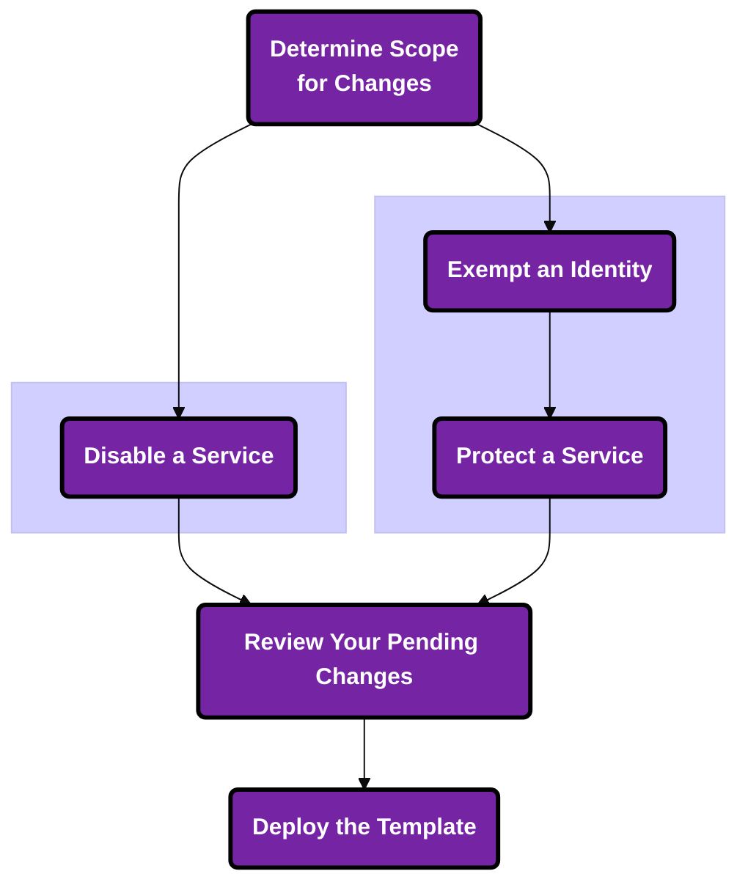

## Overview

At a high level, Sonrai's Cloud Permissions Firewall provides you with recommended service and sensitive permissions changes through a template you can deploy within your cloud. 

With Sonrai's Cloud Permissions Firewall, you gain:

<b className="centerediconhead">Immediate Visibility</b> > into every service and permission used in your running cloud (and those unused or sparsely used)

<b className="centerediconhead">Centralized Control</b> > to enable/disable services and restrict sensitive permissions to prevent misuse of any Account(s)

 

## Services Management

> How do I generate the template of recommended/desired changes?

1. Determine the scope for changes 

2. Determine the service action: 
- make an identity exemption for sensitive permissions usage (i.e. break glass accounts, deployment identities)
- protect a service
- disable a service

3. Once the service action is complete, your changes move into <a href="/cpf/permissions-firewall/pending-changes/pending-changes-intro">'pending changes' page</a> for review

4. Review the <a href="/cpf/permissions-firewall/pending-changes/deploying-in-aws">CloudFormation template and deploy it</a> to your cloud 

:::info
We are not performing any service-related changes in your cloud on your behalf - your journey through the Cloud Permissions Firewall UI from end to end will produce a template of changes that you can review and deploy once you're ready
:::

## Permissions on Demand 

Once service protections are in place, users within your organization can initiate <a href="/cpf/permissions-firewall/permissions-on-demand/requests/how-to-action-pod-requests">Permissions on Demand requests</a> for the ability to use sensitive permissions.

Permissions on Demand is a permissions-granting workflow strategy that reduces requests to internal staff (i.e. DevOps, CloudOps, etc.) by focusing on <a href="/cpf/permissions-firewall/services/#common-controls">sensitive permissions access</a>. 

Traditional just-in-time (JIT) products focus on granting and revoking permissions from identities on an 'as needed' basis. Permissions on Demand (POD) puts the focus on determining *permissions assigned* versus *permissions in use*, pinpointing instances where *sensitive permissions* are involved.

### Delegation and Collaboration FAQ

> Do <a href="/cpf/permissions-firewall/permissions-on-demand/approvers/how-to-manage-pod-approvers">Permissions on Demand Approvers</a> have delegated access? 

Yes! 

Once you assign a Permissions on Demand Approver at a scope, they are empowered to approve/deny those incoming sensitive service permissons requested by your users. These Approvers do NOT require permissions assignment within your cloud to enable this access, they are simply the gate which stands between your users and their access to sensitive permissions for services to which they already have access. 

> Can Service level changes be delegated to Org Admins? 

Yes!

A <a href="/cpf/manage/users/user-management">Cloud Permissions Firewall Admininistrator user</a> can stage changes as needed, download the CloudFormation template, and provide it to your AWS Org Admin to deploy as per your business processes.
