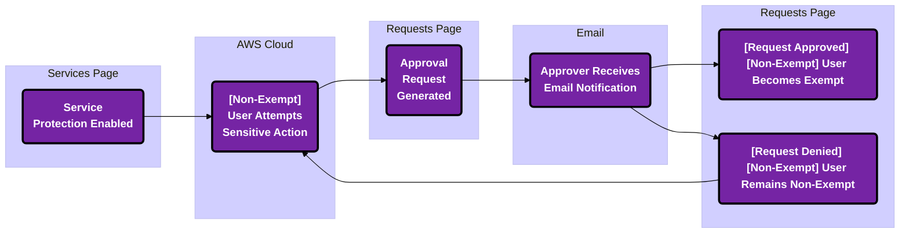

## Overview 

Permissions on Demand is a permissions-granting workflow strategy that reduces requests to internal staff (i.e. DevOps, CloudOps, etc.) by focusing on <a href="/cpf/permissions-firewall/services/#common-controls">sensitive permissions access</a>. 

Traditional just-in-time (JIT) products focus on granting and revoking permissions from identities on an 'as needed' basis. Permissions on Demand (POD) puts the focus on determining *permissions assigned* versus *permissions in use*, pinpointing instances where *sensitive permissions* are involved.

---

## The POD Lifecycle

The lifecycle of a Permissions on Demand (POD) Request can result in one of two states: approval or denial. 

 

The most common scenario where a POD request would be initiated is:

1. Implementing a <a href="/cpf/permissions-firewall/services/#service-actions">service protection</a>
  - <u>Example</u>: Protecting AWS WAF

 

2. AWS Console or CLI interaction by a non-exempt user

a) [Non-exempt] user navigates to the service within the AWS console and attempts to use one of the sensitive permissions
    - <u>Example</u>: Deleting a Web ACL

 
OR

b) [Non-exempt] user leverages AWS CLI to run a command associated with one of the defined sensitive permissions 
    - <u>Example</u>: Running the <code>delete-web-acl</code> command 

 

3. A <a href="/cpf/permissions-firewall/permissions-on-demand/requests/how-to-action-pod-requests">POD request</a> becomes present within the "Approvals" page and an email is sent to the applicable list of "<a href="/cpf/permissions-firewall/permissions-on-demand/approvers/how-to-manage-pod-approvers">Approvers</a>" 

 

4. The POD Request is either approved or denied

a) If the request is approved, the [now exempt] user becomes <a href="/cpf/permissions-firewall/services/how-to-service-protections#exempting-an-identity">listed as an exemption</a> to use sensitive permissions for the service

 
OR

 
b) If the request is denied, the [still non-exempt] user remains unable to use sensitive permissions for the service 

 

---

## FAQs

> What is a POD request?

This is a request a user initiates for the use of specific risky/sensitive permission(s) within some portion of your cloud.  

 

> When will I see a POD request come through?

Generally, a request will be triggered by an identity attempting to use the permission while Sonrai's Cloud Permissions Firewall has a block in place for use of that specific service.  

 

> How long is a POD request active once approved?

POD requests can be approved for a specific time period (1, 2, 4, 8, 12 hours).

If denied, an additional request from the user cannot be made for ~15 minutes afterwards.

 