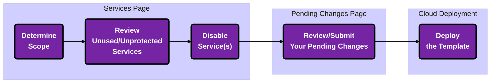

import Tabs from '@theme/Tabs';
import TabItem from '@theme/TabItem';

## Overview

Disabling service(s) can be regarded as a quick and simple method of reducing attack surface to lower the overall level of service-related risk(s) for your cloud. 

:::tip
**Before you read on for information on implementing service blocks, we recommend you first review the <a href="/cpf/permissions-firewall/services">Services page</a>* to understand key terms/concepts
:::

:::warning
Disabling a service will make the service unusable for the scope selected - even exempted identities will not be able to use it! 
:::

---

## Scope it Out 

<Tabs>
<TabItem value="Focus Org-wide" label="Focus Org-wide"> 
<h4 className="tabheader hiddenheader">Focus Org-wide</h4>

Keeping your scope set to the top-level Org-wide view allows you to make changes most efficiently as said changes will propagate down to the child OUs/Accounts. 

:::tip
If your Org is fairly large, it likely makes more sense to review the next tab on scoping to singular OU(s)/Account(s).
:::

</img>

</TabItem>
<TabItem value="Focus on a Single OU/Account" label="Focus on a Single OU/Account"> 
<h4 className="tabheader hiddenheader">Focus on a Single OU/Account</h4>

When changing your scope to a specific AWS OU/Account, the number of Services listed does not change overall but the "**Account Usage**" column reflects `x of 1` rather than the original `x of y` (*<i>where `y` represents the full number of accounts in your onboarded Organization(s)</i>). 

</img>

</TabItem>
</Tabs>

---

## Filter for Unprotected Services

Now you have a clear view of what Services are considered protected in context of either a specific account or your entire organization. 

Continue on by filtering the "**Service Status**" by "**Unprotected**" and remediate those first to make the most impact.

</img>

---

## Implementing a Service Block

### Disable Unused Services

When a service remains enabled, but unused, it provides an avenue for lateral movement in the case of a breach. 

  

    <h2 className="card__title"><Icon icon="fa-solid fa-bolt"></Icon> Scenario</h2>
    <i className="cardhr"></i>
    <i className="card__text">"We were testing out AWS Certificate Manager (CA) for an application, but have decided to use an alternate CA."</i>
  

  

<h2 className="card__title">Action</h2>
<i className="cardhr"></i>
<i className="card__text"><Icon icon="fa-solid fa-arrow-right"></Icon>  It looks like someone forgot to disable the service after testing was completed.  To remediate, click "**Disable**" then navigate to the "**Pending Changes**" page.</i>

### Disable Unauthorized Services 

As an example, when a service remains enabled it can be tempting for members of your organization to use it without following change management process(es), for example. This can lead to violations of customer-related requirements (<u>Example</u>: think GDPR), additional unexpected costs, etc. 

  

    <h2 className="card__title"><Icon icon="fa-solid fa-bolt"></Icon> Scenario</h2>
    <i className="cardhr"></i>
    <i className="card__text">"Something in one of our AWS Accounts is using API Gateway Execute which isn't on our list of authorized AWS services..."</i>
  

  

<h2 className="card__title">Action</h2>
<i className="cardhr"></i>
<i className="card__text"><Icon icon="fa-solid fa-arrow-right"></Icon> In this case, you may want to disable the entire service to ensure no identities within your organization can use it, since it isn't an authorized service for use.</i>

 

:::caution
Before putting the service block in place [in this kind of scenario], we highly recommend checking in with the owner of the AWS Account/identity first to ensure the service in question is not used for an integral part of your production/customer-facing infrastructure
:::

---

## Review Your Changes 

Now that you've scoped your view and chosen to block usage for a service entirely (either for your entire Organization or specific AWS Account(s)), click <button>Disable</button> on the confirmation modal to transfer the changes to the "**Pending Changes**" page for review. 

</img>

<u>Reference</u>: See <a href="/cpf/permissions-firewall/pending-changes/">here</a> for more information on the "**Pending Changes**" page.

