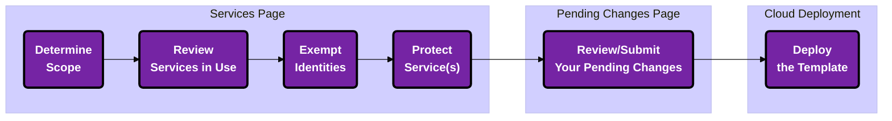

import Tabs from '@theme/Tabs';
import TabItem from '@theme/TabItem';

## Overview

Restricting access to sensitive permissions reduces risk in regards to convenient lateral movement methods. 

:::tip
**Before you read on for information on implementing service protections & exempting identities' access to sensitive permissions, we recommend you first review the <a href="/permissions-firewall/services">Services page</a>* to understand key terms/concepts
:::

Take a look at our <a href="https://sonraisecurity.com/product-tour/cloud-permissions-firewall/">demo scenario</a> to run through the motions of protecting a service! 

:::warning
Before deploying service protections, please ensure you exempt at least one break glass account!
:::

---

<Tabs>
<TabItem value="Focus Org-wide" label="Focus Org-wide"> 
<h4 className="tabheader hiddenheader">Focus Org-wide</h4>

Keeping your scope set to the top-level Org-wide view allows you to make changes most efficiently as said changes will propagate down to the child OUs/Accounts. 

:::tip
If your Org is fairly large, it likely makes more sense to review the next tab on scoping to singular OU(s)/Account(s).
:::

</img>

</TabItem>
<TabItem value="Focus on a Single OU/Account" label="Focus on a Single OU/Account"> 
<h4 className="tabheader hiddenheader">Focus on a Single OU/Account</h4>

When changing your scope to a specific AWS OU/Account, the number of Services listed does not change overall but the "**Account Usage**" column reflects `x of 1` rather than the original `x of y` (*<i>where `y` represents the full number of accounts in your onboarded Organization(s)</i>). 

</img>

</TabItem>
</Tabs>

---

## Sort by Status

Now you have a clear view of what Services are in use in context of either a specific account or your entire organization, with the unused Services listing at the bottom. 

</img>

---

## Implement Service Protections \[Sensitive Service Access Controls\]

When sensitive permissions for a service remain enabled, but unused, it provides an avenue for lateral movement in the case of a breach. 

  

    <h2 className="card__title"><Icon icon="fa-solid fa-bolt"></Icon> Scenario</h2>
    <i className="cardhr"></i>
    <i className="card__text">"Our developers use EC2 extensively and we do have some machine identities, but our Sales staff don't need those sensitive permissions."</i>
  

  

<h2 className="card__title"> Action</h2>
<i className="cardhr"></i>
<i className="card__text"><Icon icon="fa-solid fa-arrow-right"></Icon> This scenario is a little more complicated <a className="hyperlite" href="/cpf/permissions-firewall/services/how-to-disable-services#implementing-a-service-block">than a straightforward service block</a>... You can't <a className="hyperlite" href="/cpf/permissions-firewall/services/how-to-disable-services">disable this service</a> across the board, but you have defined the requirements above and can leverage the <button>Protect</button> > <button>Modify</button> buttons to implement least privilege controls. </i>

 

In this scenario, lets say we have separate AWS Accounts configured for development and sales. We can disable the EC2 service for the sales account and protect the EC2 service for the development account, making identitiy exemptions as needed.

On the Services page, on the right-hand side of the table row, click [the alternate Service Action] <button>Protect</button>. 

Clicking <button>Protect</button> produces a slide-in panel from the right, detailing: 
- a concise problem statement ("EC2 contains x sensitive permissions") including a linked pop out modal listing the associated sensitive permissions in question 
</img>

</img>

- if applicable, a linked list of identities previously/presently exempted at this scope
- a list of accounts within scope in which the service should be either disabled or protected
    - our "**Suggested Exemptions**" recommendations for each account (i.e. the identities we think you should deem as acceptable use for these sensitive permissions)

### Restrict a Service for Account(s) Within Scope

Within the development account row of the slide-in panel table, click <button>Protect</button> to limit access to this service to only those identities that are currently using the permissions within the past 90 days (i.e. our "**Suggested Exemptions**" pre-populated list). 

</img>

:::info
These types of protections do not remove previously created elements of your cloud, simply the ability for identities to make more. 

For example, the sensitive permissions involved with the EC2 service could be controlled and removed from most [or perhaps all] users in a particular part of your cloud hierarchy. Removing this permission from your cloud identities, however, does not remove any existing internet gateways!
:::

#### Exempting an Identity

Exemptions are used to override a specific service protection for a particular identity. Sometimes there are exceptions to the list and identities that lie outside of our "**Suggested Exemptions**" that you may like to exempt such as **break-glass identities** or identities for newly onboarded employees.

:::caution 
Even exempted identities are subject to abide by service blocks, meaning they too will be blocked from using any permissions afforded to them for that particular disabled service! If an identity requires the service's sensitive permissions, you will need to protect the service instead and remove permissions from identities which have no need. 
:::

<u>Reference</u>: See <a href="/cpf/permissions-firewall/permissions-on-demand/personas#exemption-worthy-identities">here</a> for more information on **exemption-worthy** personas.

 

  

    <h2 className="card__title"><Icon icon="fa-solid fa-bolt"></Icon> Scenario</h2>
    <i className="cardhr"></i>
    <i className="card__text">"We enabled the EC2 service protection in the past for the developers account, but our new hire Robin still can't use any of those sensitive permissions for the EC2 service"  <b>We need to exempt the identity!</b></i>
  

  

<h2 className="card__title"> Action</h2>
<i className="cardhr"></i>
<i className="card__text"><Icon icon="fa-solid fa-arrow-right"></Icon> Because it's a new identity, it hasn't had the chance to *use* the service within the past 90 days and so it's not included within the baselined service protection grouping already. We need to explicitly allow this identity to use the EC2 service and leverage the permissions you've assigned within your cloud.</i>

 

To add an exemption, click <button>Add</button> and paste in the identity's AWS ARN to add it to the list of "**Suggested Exemptions**" for the account in scope.

</img>
  

:::tip
If necessary, hover over a "**Suggested Exemption**" then click the 'X' to remove a recommendation from the list

**Please note**: Removing an identity from the "**Suggested Exemptions**" list will remove them *forever* (i.e. they will not reappear within that list, you will need to manually add the exemption by the <button>Add</button> button using its ARN [if exemption is required at a later date])
:::

---

## Review Your Changes

Now that you've scoped your view and chosen to protect a service and/or exempt an identity's access to service(s), click <button>Disable</button>/<button>Protect</button> on the confirmation modal to transfer the changes to the "**Pending Changes**" page for review. 

<u>Reference</u>: See <a href="/cpf/permissions-firewall/pending-changes/">here</a> for more information on the "**Pending Changes**" page.

