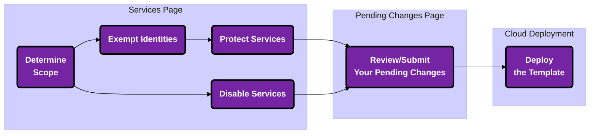

## Overview

Unused [*enabled*] Services - a useful attack vector for threat actors to leverage! 

Maybe you forgot to turn off AWS S3 when you were done testing storage solutions, or perhaps one of your overprivileged developers took the initative to test that out for you (unintentionally bypassing your change management process...)

Sonrai's Cloud Permissions Firewall immediately notifies you whether you have any unused but enabled services and/or sensitive permissions access to review. 

---

## Scope 

Initially, you may be wondering "*What am I looking at?..*", but a better question is "*What do I want to look at first?*", which is answered by the top left-hand dropdown providing the scope of the Service-related data in view. 

</img>
  

From here you can select a: 
- cloud type to narrow down the table results
- logical grouping (the entire Organization, an Organizational Unit (OU), Accounts [nested under an OU])

<u>Notes</u>: 
- Scope convention:
  - `<cloud type/>/<cloud native path/>` 
- A scope of `/` refers to the entire cloud

| Cloud Type | Path |
| --- | --- |
| AWS        |    `aws/<organization>/<organizational unit*>`,   `aws/<organization>/<organizational unit*>/<account>`  | 
| Azure    |      `azure/<tenant>/<management-group*>/<subscription>` | 
| GCP       |     `gcp/<gcp-organization>/<folder*>/<project>` | 

 

:::tip
Your selected scope carries through to each action you take within the Services page (i.e. protections will only populate possibilities for the accounts/identities in the chosen scope)
:::

---

## Hero Cards 

Once your scope is adjusted, the hero cards (along with the services table) will adjust to reflect the drilldown number of: 
- One Click Protection
- IAM users and roles with excessive privilege 
- Zombies 
- Unused services 

The hero cards provide a preview of the identities/services/etc. involved in Sonrai's recommended changes for these categories and a convenient single-click to action!

</img>

### IAM Users and Roles With Excessive Privilege

</img>

Unused sensitive service access is a latent attack surface that enables attackers to gain footholds and move laterally within your organization.

Examples involving sensitive service permissions:
- creating a new EC2 VPC
- updating the function code of a lambda
- executing an ECS command

<u>Reference</u>: See <a href="/cpf/permissions-firewall/services/hero-iam-excess-priv">here</a> for information on IAM users and roles with excessive privilege.

### Zombies

</img>

A Zombie is considered to be any identity (user, role, etc.) that has been unused for at least 90 days.

Inactive but enabled Zombie identities provide the capability for threat actors to escalate privileges, move laterally, gain access to sensitive data, and more.

Rather than deleting Zombie identities entirely, we opt to help you quarantine them so they remain present within your cloud but can no longer be used. Sometimes Zombies reanimate after some time, but are subject to requesting sensitive service access through Permissions on Demand (PoD).

<u>Reference</u>: See <a href="/cpf/permissions-firewall/services/hero-zombies">here</a> for information on zombie identities.

### Unused Services 

</img>

Service blocks remove the ability for identities within your cloud to use any of the permissions associated with the service.

Disabling service(s) can be regarded as a quick and simple method of reducing attack surface to lower the overall level of service-related risk(s) for your cloud. 

<u>Reference</u>: See <a href="/cpf/permissions-firewall/services/hero-unused-services">here</a> for information on unused services.

### Regions [coming soon!]

</img>

Unused but enabled regions provide attackers a vector for environmental movement and increase risk of compliance breach. 

Regional blocks remove the ability for identities within your cloud to use any services within the disabled region(s).

---

## Service Status

Key terms and concepts for each possible status you may encounter in the Services table: 

  <b className="centerediconhead smallcaps largefont">Unprotected</b>
    
  All accounts [in scope] allow this service to be used without protection
    (i.e. <i>you have not implemented any blocks/protections through Sonrai's CPF yet</i>)

  <b className="centerediconhead smallcaps largefont">Partially Protected</b>
   
  *Some* accounts [in scope] fully allow this service without protections 
    (*<i>some accounts may be blocked from using the service and some may use the service with protections in place</i>) 

  <b className="centerediconhead smallcaps largefont">Protected</b>
   
  All accounts [in scope] are restricted with one or more cloud controls enabled 
    (*<i>all accounts have at least one cloud control in place (i.e. some accounts may be blocked from using the service and some may use the service with protections in place)</i>)

  <b className="centerediconhead smallcaps largefont">Disabled</b>
   
  This service is disabled in all accounts 
    (i.e <i>the service cannot be used at all</i>)

 

</img>

:::tip
Any status with `"(pending)"` indicates there are entries within the <a href="/cpf/permissions-firewall/pending-changes/pending-changes-intro">Pending Changes</a> page to review/action 
:::

---

## Service Controls 

Service Controls are one or more blocks/protections that can be applied to the cloud to restrict or prevent actions or activities through:
- *cloud-native frameworks*
    - like Azure Policy or AWS Config

These active controls dictate what can and cannot be done to and by the service within your cloud estate, like: 
- who and what can access the service specifically in a sensitive manner 

### Common Controls

The number of Service Controls that apply to any given service will vary based on the nature of the service, but the most common controls you'll see are: 

  <b className="centerediconhead smallcaps largefont">Cloud Service Block</b>
    
  The first step to achieving an effective Least Privilege footprint in a cloud estate; limiting all permission(s) related to that service from use by any identity

  <b className="centerediconhead smallcaps largefont">Sensitive Service Access</b>
   
  The second step in achieving effective Least Privilege; enabling only those identities that have a proven need for this level of sensitive permissions access for the service

 

:::info
These types of blocks/protections do not remove previously created elements of your cloud, simply the ability for identities to make more. 

For example, the sensitive permissions involved with the EC2 service could be controlled and removed from most [or perhaps all] users in a particular part of your cloud hierarchy. Removing this permission from your identities, however, does not remove any existing internet gateways!
:::

---

## Service Actions 

There are several options as per how you take action for each service, depending on your use case: 

  <b className="centerediconhead smallcaps largefont">Disable</b>
    
  Disable the service entirely so that no accounts within your organization can use it (i.e. all permissions related to this service are blocked for all identities within the selected account(s) [in scope])

  <b className="centerediconhead smallcaps largefont">Protect</b>
   
  The service is being moved into a protected state. Users can elect which cloud controls are to be enabled. 
    - <b>Modify</b>: Once you click "**Protect**", the modify pane allows you to elect which cloud controls are to be enabled for the service. 
    
    [*If no cloud controls are turned on, the service stays as "**Unprotected**" status]

  <b className="centerediconhead smallcaps largefont">Unprotect</b>
   
  The entire service will be unlocked for use by all identities that have grants to the service (zero cloud controls will be enabled in this state)

 

:::info
When we talk about a Service like AWS EC2, Azure Functions, etc. being "*protected*", we mean those that have one or more Service Control(s) applied. These would be services for which you clicked the "**Disable**"/"**Protect**" action at a given scope
:::

 

</img>
  

:::tip
Check out our series of how-to pages next!
- How-to: <a href="/cpf/permissions-firewall/services/how-to-service-protections#exempting-an-identity">Exempt Identities</a>
- How-to: <a href="/cpf/permissions-firewall/services/how-to-disable-services">Disable Services</a>
- How-to: <a href="/cpf/permissions-firewall/services/how-to-service-protections">Protect Services</a>
:::